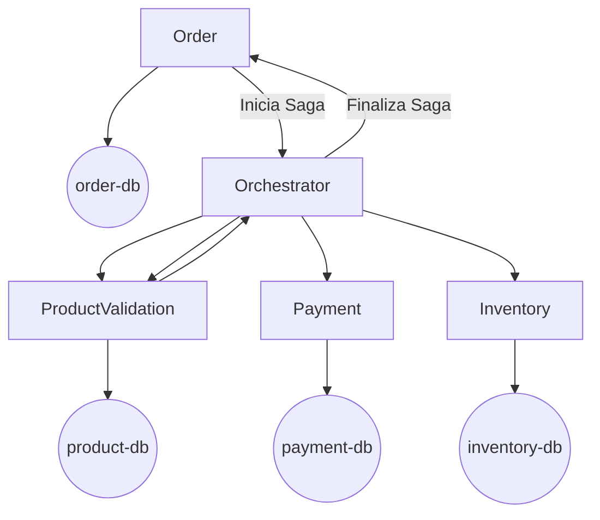

# Order Service - Microsserviços Padrão Saga Orquestrado
## Em nossa arquitetura vamos ter 5 serviços, sendo eles Order, Orchestrator, Product Validation, Payment e o Inventory.

## Tecnologias
* **Java 17**
* **Spring Boot 3**
* **Apache Kafka**
* **API REST**
* **PostgreSQL**
* **MongoDB**
* **Docker**
* **docker-compose**
* **Redpanda Console**

